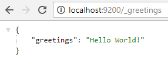
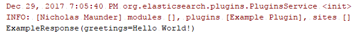

This contains the bare minimum source code for a plugin supporting both RESTful and JAVA APIs.

Even it's a good idea to pull down the source code and go read it, however before that, you might want to get a feel on why the project is structured in the current manner by reading through the explanation that follows.

# Prerequisite

- Elasticsearch 2.3.5
- Maven
- Java


# Manual

- `git clone` this project
- `cd` into plugin-tcp-http
- `mvn package`, then you will find
  - a jar in the folder target
  - a zip in the folder target\releases
- [`plugin isntall`](https://www.elastic.co/guide/en/elasticsearch/plugins/current/plugin-management-custom-url.html#plugin-management-custom-url) the zip into your local ES
- create a JAVA program with the jar included in the build path


# Project Structure

Ensure that the files listed as follows exist in your project:

```
${your_plugin_project_name}
|_ src
   |_ main
      |_ assembly
         |_ plugin.xml
      |_ java
         |_ ${your_project_directory}
            |_ ${your_plugin}.java
      |_ resources
         |_ plugin-descriptor.properties
|_ pom.xml
```


# Assembly

As any ES Java plugin needs to be compressed into a zip file in order to be installed via `plugin install`, you need to have a folder named ***assembly* ** containing a XML file. Refer to [Maven's official guidance on creating assemblies](https://maven.apache.org/guides/mini/guide-assemblies.html) for more information.

A reminder is that in ES 2.3.5, "" (empty) works fine for element `outputDirectory` as shown below. However, according the [ES 6.x's document](https://www.elastic.co/guide/en/elasticsearch/plugins/6.x/plugin-authors.html#_plugin_structure), the element must be `<outputDirectory>elasticsearch</outputDirectory>`.

```
<files>
    <file>
        <outputDirectory></outputDirectory>
    </file>
</files>
<dependencySets>
    <dependencySet>
        <outputDirectory></outputDirectory>
    <dependencySet>
<dependencySets>
```


# RESTful API

There are must-haves:
- a function `public void onModule(RestModule restModule)` in ${your_plugin}.java
- a class `extends BaseRestHandler`
- a class `implements ToXContent`

As a demo, this project simply returns "Hello World!" when the URL path is "_greetings":



# JAVA API

There are must-haves:
- a function `public void onModule(ActionModule actionModule)` in ${your_plugin}.java
- a class `extends ActionRequest`
- a class `extends ActionResponse`
- a class `extends ActionRequestBuilder`
- a class `extends TransportAction`
- a class `extends Action`
- a Client-used class that wraps `ElasticsearchClient` and prepares the request builder

Then run a JAVA program with the following code:

```java
Settings settings = Settings.builder().put("cluster.name", "${your_cluster_name}").build(); // Pay Attention, please
TransportClient transportClient = TransportClient.builder().settings(settings).addPlugin(ExamplePlugin.class).build(); // Pay Attention, please
TransportAddress address = new InetSocketTransportAddress(InetAddress.getByName("localhost"),9300);
transportClient.addTransportAddress(address);
val client = new ExampleClient(transportClient);
val resp = client.prepare().execute().actionGet();
System.out.println(resp);
```
You are able to see the output as follows:




# Q&A

## Why "onModule"?

In ES's source code, `PluginService` looks for this specific method to extend ES's functionalities. And it's hard coded as follows:

```java
for (Plugin plugin : jvmPlugins.values()) {
  List<OnModuleReference> list = new ArrayList<>();
    Class classes = plugin.getClass();
    for (Method method : plugin.getClass().getMethods()) {
        if (!method.getName().equals("onModule")) {
            continue;
        }
        // this is a deprecated final method, so all Plugin subclasses have it
        if (method.getParameterTypes().length == 1 && method.getParameterTypes()[0].equals(IndexModule.class)) {
            continue;
        }
        if (method.getParameterTypes().length == 0 || method.getParameterTypes().length > 1) {
            logger.warn("Plugin: {} implementing onModule with no parameters or more than one parameter", plugin.name());
            continue;
        }
        Class moduleClass = method.getParameterTypes()[0];
        if (!Module.class.isAssignableFrom(moduleClass)) {
            logger.warn("Plugin: {} implementing onModule by the type is not of Module type {}", plugin.name(), moduleClass);
            continue;
        }
        list.add(new OnModuleReference(moduleClass, method));
    }
    if (!list.isEmpty()) {
        onModuleReferences.put(plugin, list);
    }
}
```

## How to debug?
Refer to [local setup](https://github.com/WangFangda/elasticsearch-custom-plugin-tcp-http/tree/master/local-setup), please.
