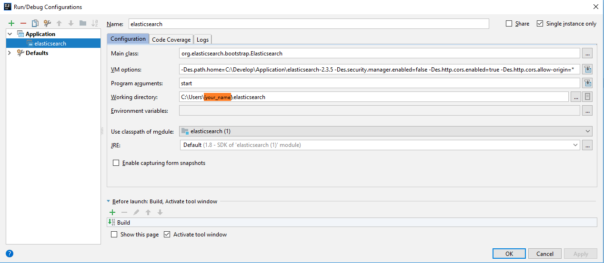
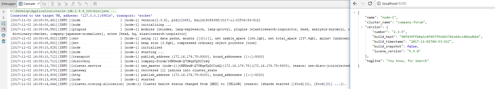
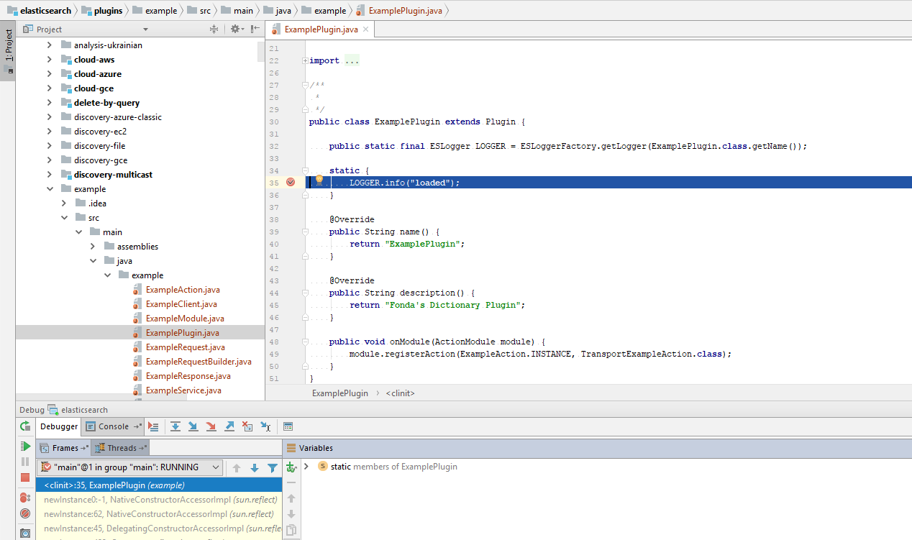

# Target

This helps you run Elasticsearch source code in debug mode from Intellij.
Sorry that I am not an Eclipse user, but hopefully you can be inspired by the settings.

# Software

Name          | Version
--------------|:-----------------------:
Java          | 1.8.0_121
Maven         | 3.3.9 (Intellij bundled)
Git           | 2.14.1.windows.1

# Source code

Suppose that you want to put the source code under `C:\Users\${your_name}\`, run:

```bash
$ C:\Users\${your_name}
$ git clone https://github.com/elastic/elasticsearch.git
# A folder named "elasticsearch" exists (as C:\Users\${your_name}\elasticsearch), after running the above command

$ cd elasticsearch

$ git checkout v2.3.5
$ git checkout -b 2.3.5
```

So far, you have a specific version (in the example commands, the specific version is 2.3.5).
If you want to check another version (depending on your development requirements),
then simply change 2.3.5 to the version wanted.

# Play with Source Code

### Goal

Elasticsearch's entry is `org.elasticsearch.bootstrap.Elasticsearch` that has a `public static void main` method, same as all the other simple "Hello World" Java programs.
We are going to run this main method eventually in a debug mode.

Comes some hacking, in order to run this main method.


### Add local repo

- open `pom.xml` under `C:\Users\${your_name}\elasticsearch`
- find (Ctrl+F) the element `<repositories>`
- append a child element as follows

```
    <repositories>
        ... some existing elements
        <!-- ↓↓↓ append this ↓↓↓ -->
        <repository>
            <id>local</id>
            <name>my local repo</name>
            <url>file://C:\Users\${your_name}\.m2\repository</url>
        </repository>
        <!-- ↑↑↑ append this ↑↑↑ -->
    </repositories>
```

**Notice**: ensure that ${your_name} is replaced with the path where your `.m2` folder actually exists. See more about local Maven repository [here](https://maven.apache.org/guides/mini/guide-configuring-maven.html#Configuring_your_Local_Repository).

### build elasticsearch core


###### "mvn install" necessary dependencies

Here "install" means "installing to your local repository" during Maven's [lifecycle](https://maven.apache.org/guides/introduction/introduction-to-the-lifecycle.html#A_Build_Lifecycle_is_Made_Up_of_Phases).
And the dependencies are:
- dev-tools
- rest-api-spec

```
$ cd C:\Users\${your_name}\elasticsearch\dev-tools
$ mvn install
# After "mvn install" succeeds, you could find dev-tools-2.3.5-SNAPSHOT exists (meaning successfully installed) in C:\Users\${your_name}\.m2\repository\org\elasticsearch\dev-tools

$ cd C:\Users\${your_name}\elasticsearch\rest-api-spec
$ mvn install
# After "mvn install" succeeds, you could find rest-api-spec-2.3.5-SNAPSHOT exists (meaning successfully installed) in C:\Users\${your_name}\.m2\repository\org\elasticsearch\rest-api-spec
```

###### "mvn package" elasticsearch's core

```
$ cd C:\Users\${your_name}\elasticsearch\core
$ mvn package
# After "mvn package" succeeds, a module named "elasticsearch (1)" will be generated and it will be used soon in the section that follows.
```

### Configure

- "Run" (Tab) -> "Edit Configurations"
- "+" Application, as follows:

  

**Notice**:
- without [successful build](#mvn-package-elasticsearchs-core), the module "elasticsearch (1)" will not appear.
- `path.home` is your local home directory for Elasticsearch to find environment configurations, that contains `config`(a folder) and `plugins`(a folder).


### Code Change

```
in org.elasticsearch.Version.java ...

//                            the original code sets "snapshot" true ↓↓↓
//    public static final Version V_2_3_5 = new Version(V_2_3_5_ID, true, org.apache.lucene.util.Version.LUCENE_5_5_0);
//                                        change "true" to "false" ↓↓↓
    public static final Version V_2_3_5 = new Version(V_2_3_5_ID, false, org.apache.lucene.util.Version.LUCENE_5_5_0);

    public static final Version CURRENT = V_2_3_5;

```

Do the above hacking, otherwise you will get a runtime error `Likely root cause: java.lang.IllegalStateException: C:\Develop\Application\elasticsearch-2.3.5\modules\lang-expression-2.3.5.jar requires Elasticsearch 2.3.5, your system: 2.3.5-SNAPSHOT`.

### Debug

Fire "debug" and you will get Elasticsearch run successfully as follows:

  

# Play with Custom Plugin

There are different ways of debugging your custom plugin:
1) create an integration test
2) change `${path.home}` to your local Elasticsearch source code's base directory
3) remote debug

As you are already able to debug in your local IDE after following the aforementioned sections,
there is no disadvantage to try remote-debugging your custom plugin.

### Principle

You are guaranteed to see intermediate results(via breakpoints) as long as source code (i.e., .java files) exists in your IDE based on [Java Platform Debugger Architecture (JPDA)](https://docs.oracle.com/javase/8/docs/technotes/guides/jpda/).


### Copy Source Code

Suppose that you want to put the custom plugin's source code under `C:\Users\${your_name}\` with the following structure:

```
example
|__ src
|__ pom.xml
```

In pom.xml, add the following path to copy the source code (or the rest are omitted):

```
    <build>
        <!-- omitted -->
        <plugins>
            <!-- omitted -->
            <!-- ↓↓↓ make sure the have the copy section ↓↓↓ -->
            <plugin>
                <artifactId>maven-resources-plugin</artifactId>
                <version>3.0.2</version>
                <executions>
                    <execution>
                        <id>copy-resources</id>
                        <phase>package</phase>
                        <goals>
                            <goal>copy-resources</goal>
                        </goals>
                        <configuration>
                            <outputDirectory>${basedir}\..\elasticsearch\plugins\example</outputDirectory>
                            <resources>
                                <resource>
                                    <directory>${basedir}</directory>
                                </resource>
                            </resources>
                        </configuration>
                    </execution>
                </executions>
            </plugin>
            <!-- ↑↑↑ make sure the have the copy section ↑↑↑ -->
            <!-- omitted -->
        </plugins>
    </build>
```

### Remote Debug

First, do in the same way you install your custome plugin:
- package the plugin into a zip file
- install the plugin to `${path.conf}\plugins`

Then, debug Elasticsearch.java as in [the previous section](#debug) and you are able to see:

  